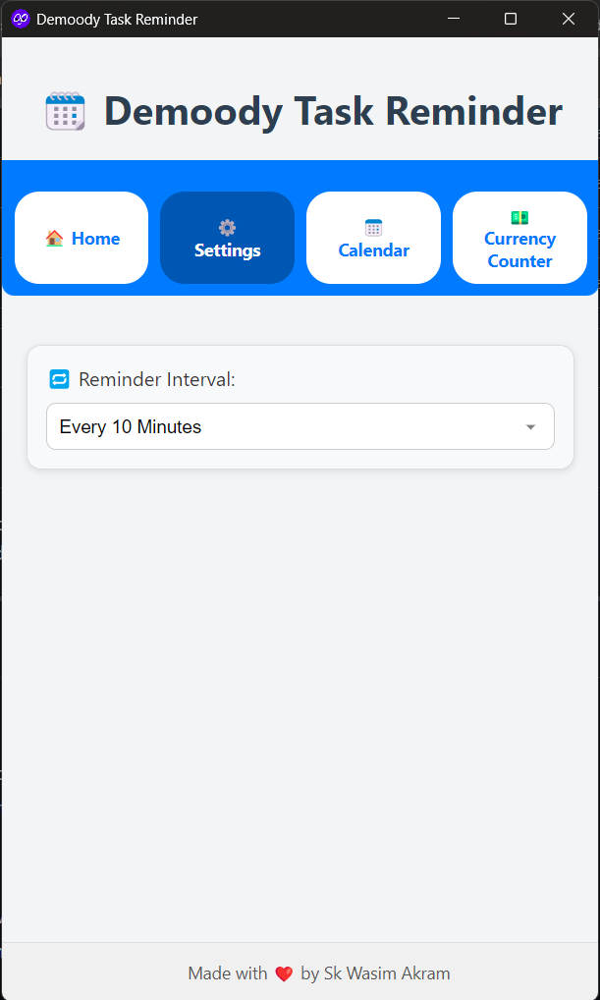
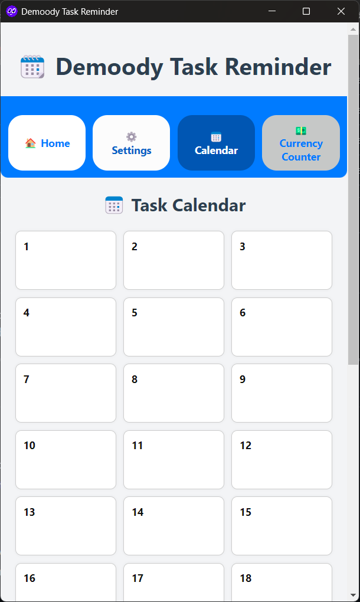
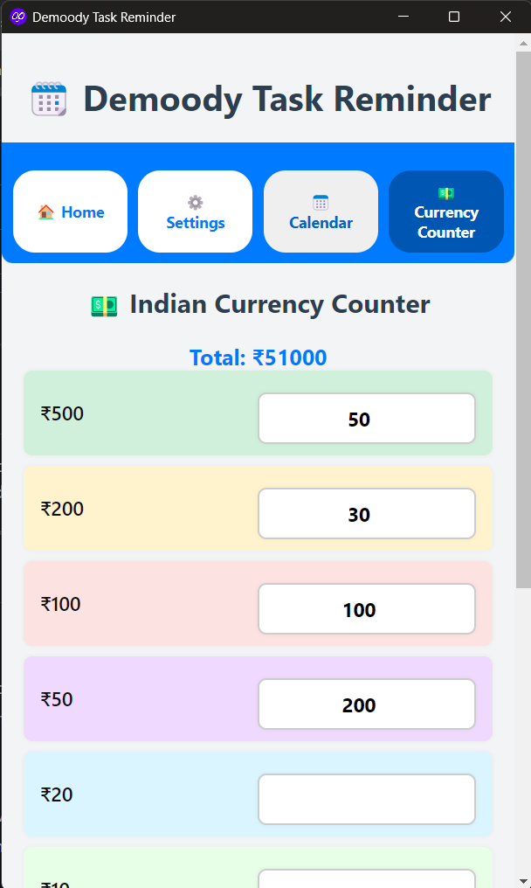

# 🗓️ Demoody Task Reminder

**Demoody Task Reminder** is a lightweight desktop application built using **Electron**. It helps users manage their daily tasks with smart reminders, an interactive calendar, and a built-in currency counter for quick cash handling.

---

## 🚀 Features

### ✅ Task Management
- Add, edit, and delete tasks with title, description, and scheduled date/time.
- Tasks are saved locally in a lightweight SQLite database.

### 🔔 Smart Reminders
- Get desktop notifications and sound alerts when a task is due.
- Set your preferred reminder interval (2–60 minutes).

### 📅 Calendar View
- View tasks in a visual monthly calendar layout.
- Easily see which days have scheduled tasks.

### 💵 Indian Currency Counter
- Quickly calculate the total value of your currency notes.
- Each note denomination is color-coded and includes a large input for ease of use.
- Live total value updates with proper comma formatting.

### 📌 Additional Features
- Minimizes to system tray instead of exiting on close.
- Auto-launches on system startup (configurable).
- Clean and responsive UI for a user-friendly experience.

---

## 📂 Project Structure

```
Demoody-Task-Reminder/
│
├── db.js               # SQLite DB logic
├── preload.js          # Secure bridge between renderer and main process
├── main.js             # Main Electron process
├── renderer.js         # Frontend JS for logic/UI updates
├── index.html          # Main user interface
├── package.json        # App metadata & dependencies
├── icon.ico            # App icon
├── icon-tray.png       # System tray icon
└── notes/              # Currency note images (optional)
```

---

## 🧑‍💻 Getting Started

### Prerequisites
- [Node.js](https://nodejs.org/) (v16 or above recommended)
- npm (comes with Node)

### Installation

```bash
git clone https://github.com/yourusername/demoody-task-reminder.git
cd demoody-task-reminder
npm install
```

### Run the App

```bash
npm start
```

---

## 🏗️ Build for Distribution

You can build an `.exe` installer using **Electron Forge** or **electron-builder**.

### Option 1: Electron Forge (Recommended)

```bash
npm install --save-dev @electron-forge/cli
npx electron-forge import
npm run make
```

Find the built installer in `out/make/`.

### Option 2: electron-builder

```bash
npm install --save-dev electron-builder
npm run build
```

> Update the `build` config in `package.json` accordingly.

---

## 🛠️ IPC Channels (Renderer ↔ Main)

| Channel                    | Description                         |
|---------------------------|-------------------------------------|
| `save-task`               | Saves a new task                    |
| `get-tasks`               | Retrieves all saved tasks           |
| `update-task`             | Updates an existing task            |
| `delete-task`             | Deletes a task by ID                |
| `set-reminder-interval`   | Sets the global reminder interval   |
| `init-interval` (send)    | Sends interval value to renderer    |
| `play-sound` (send)       | Triggers sound notification         |

---

## 📸 Screenshots

> Few sample screenshot form the Desktop App:
```
)



```

---

## Badges
[](https://github.com/ryo-ma/github-profile-trophy)

---

## Author
**Develope By** - [Sk Wasim Akram](https://github.com/skwasimakram13)

- 👨‍💻 All of my projects are available at [https://skwasimakram.com](https://skwasimakram.com)

- 📝 I regularly write articles on [https://blog.skwasimakram.com](https://blog.skwasimakram.com)

- 📫 How to reach me **hello@skwasimakram.com**

- 🧑‍💻 Google Developer Profile [https://g.dev/skwasimakram](https://g.dev/skwasimakram)

- 📲 LinkedIn [https://www.linkedin.com/in/sk-wasim-akram](https://www.linkedin.com/in/sk-wasim-akram)

---

## 📃 License

This project is licensed under the [MIT License](LICENSE).

---

## 💡 Future Ideas

- Add dark mode toggle
- Export/import tasks
- Enable cross-device sync via Firebase or Supabase
- Currency Counter with export/print report
